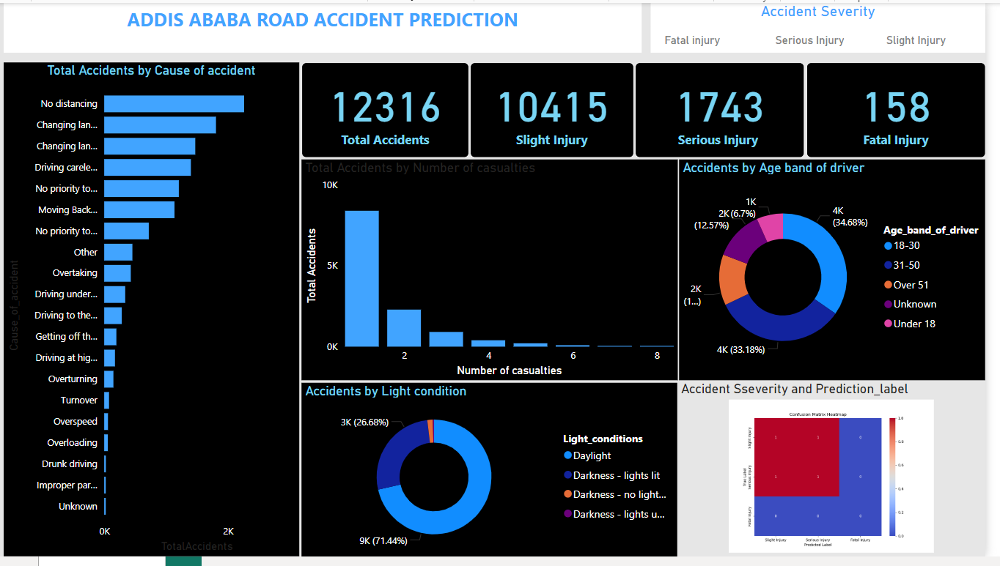

# BI Assignment: Power BI Integration with ML Model

This project demonstrates the integration of **Power BI** with a machine learning model for predictive analytics and visualizations. The assignment focuses on using the **Addis Ababa Road Accident Dataset** to build a prediction model and connect it to Power BI for creating insightful dashboards.

---
## Dashboard Preview

## Project Overview

The main goal of this project is to:
1. Train a machine learning model to predict accident severity using the **Addis Ababa Road Accident Dataset**.
2. Save the trained model and import it into **Power BI** using Python scripting.
3. Create visualizations in Power BI to showcase predictions and data insights.

---

## Files Included

- **Group 4 - BI Assignment.pbix**: The Power BI file containing the final dashboard and visuals.
- **KNN_Model.pkl**: The trained K-Nearest Neighbors (KNN) model file used for predictions.
- **PowerBi PyCaret.ipynb**: Jupyter notebook file for building and saving the model using PyCaret.
- **RTA_Dataset_Cleaned.csv**: The cleaned dataset used for training and predictions.

---

## Steps to Reproduce

### 1. Data Preparation
- Use the provided `RTA_Dataset_Cleaned.csv` dataset.
- Perform exploratory data analysis (EDA) and preprocessing to clean and prepare the data for modeling.

### 2. Model Training
- Train a machine learning model using **PyCaret**.
- The model predicts accident severity based on features from the dataset.
- Save the trained model as `KNN_Model.pkl`.

### 3. Power BI Integration
- Import the cleaned dataset into Power BI.
- Use the Python script feature in Power BI to:
  1. Load the `KNN_Model.pkl` file.
  2. Use the model to generate predictions.
- Integrate predictions with Power BI visuals.

### 4. Visualization in Power BI
- Create dynamic dashboards and visuals to:
  - Display accident severity predictions.
  - Highlight patterns and trends in the data.
  - Showcase model insights, such as prediction confidence.

---

## Key Features

- **AutoML Integration**: Leveraging PyCaret for low-code machine learning.
- **Power BI Scripting**: Using Python in Power BI to connect and use the trained model.
- **Interactive Dashboards**: Visualizing accident severity predictions and other insights.

---

## Technologies Used

- **Python**: For data preprocessing and model training.
  - Libraries: PyCaret, Pandas, scikit-learn
- **Power BI**: For creating interactive dashboards and integrating Python scripting.

---

## How to Use

1. Open the `Group 4 - BI Assignment.pbix` file in Power BI.
2. Ensure Python is installed and set up in Power BI with required libraries (`pycaret`, `pandas`, etc.).
3. Run the Python script in Power BI to load the model and generate predictions.
4. Explore the visuals and interact with the dashboard to gain insights.

---
